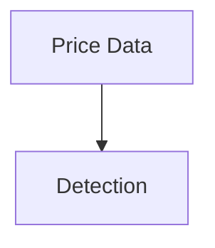

# Feature Toggle Guide - Reversibility System

## Overview

This document explains how to enable/disable the new documentation enhancements independently. Each feature can be toggled on/off without affecting others.

---

## 🎛️ Feature List

All features added in the **Site Content Audit (Nov 2025)** enhancement phase:

| Feature | Status | Files | Toggle Method |
|---------|--------|-------|---------------|
| **1. Configuration Recipes** | ✅ Ready | `ref-configuration-recipes/` | Delete folder or remove from nav |
| **2. Feedback Mechanism** | ✅ Ready | `js/feedback-system.js`, `css/feedback.css` | Comment out includes |
| **3. Visual Sitemap** | ✅ Ready | `assets/site-structure.html` | Remove include from index |
| **4. Mermaid Diagrams** | ✅ Ready | Embedded in product pages | Remove `mermaid` code blocks |
| **5. Callout Boxes** | ✅ Ready | `css/visual-enhancements.css` | Comment out CSS file |

---

## 📁 File Structure (New Files)

```
signalpilot-docs/
├── ref-configuration-recipes/        # NEW: Configuration recipes page
│   └── index.html
├── assets/
│   ├── site-structure.html            # NEW: Visual sitemap
│   └── diagrams/                      # NEW: Standalone diagram files
│       ├── pentarch-flow.svg
│       ├── indicator-selection.svg
│       └── workflow-sequence.svg
├── js/
│   ├── feedback-system.js             # NEW: Feedback mechanism
│   └── mermaid-config.js              # NEW: Mermaid.js configuration
├── css/
│   ├── feedback.css                   # NEW: Feedback button styles
│   └── visual-enhancements.css        # NEW: Callout boxes, separators
└── FEATURE_TOGGLE_GUIDE.md            # THIS FILE
```

---

## 🔄 How to Toggle Each Feature

### Feature 1: Configuration Recipes Page

**To DISABLE:**
```bash
# Option 1: Remove from navigation (keeps file, hides from menu)
# Edit mkdocs.yml or nav includes - remove "Configuration Recipes" link

# Option 2: Delete the page entirely
rm -rf ref-configuration-recipes/
```

**To RE-ENABLE:**
```bash
# Restore from git
git checkout origin/claude/site-content-audit-011CUnoRstYeJVgQkDTHNUpG -- ref-configuration-recipes/
```

**Impact:** None on other features. Standalone page.

---

### Feature 2: Feedback Mechanism

**To DISABLE:**

**Option A: Comment out the includes** (Recommended - keeps files)
```html
<!-- In your page template or _includes/footer.html -->

<!-- FEEDBACK FEATURE - To disable, comment out these lines -->
<!--
<link rel="stylesheet" href="{{ base_url }}/css/feedback.css">
<script src="{{ base_url }}/js/feedback-system.js"></script>
-->
```

**Option B: Delete the files**
```bash
rm js/feedback-system.js
rm css/feedback.css
```

**To RE-ENABLE:**
```bash
# Uncomment the lines in template OR restore files
git checkout origin/claude/site-content-audit-011CUnoRstYeJVgQkDTHNUpG -- js/feedback-system.js css/feedback.css
```

**Impact:** None. No dependencies.

---

### Feature 3: Visual Sitemap

**To DISABLE:**
```html
<!-- In index.html, find and comment out: -->

<!-- VISUAL SITEMAP - To disable, comment out this section -->
<!--
<div class="sp-sitemap-container">
  <iframe src="assets/site-structure.html"></iframe>
</div>
-->
```

**Or delete the file:**
```bash
rm assets/site-structure.html
```

**To RE-ENABLE:**
```bash
# Uncomment in index.html OR restore file
git checkout origin/claude/site-content-audit-011CUnoRstYeJVgQkDTHNUpG -- assets/site-structure.html
```

**Impact:** None. Standalone component.

---

### Feature 4: Mermaid Diagrams

**To DISABLE:**

**Option A: Disable Mermaid.js globally**
```html
<!-- In page template, comment out Mermaid initialization -->

<!-- MERMAID DIAGRAMS - To disable, comment out -->
<!--
<script src="https://cdn.jsdelivr.net/npm/mermaid/dist/mermaid.min.js"></script>
<script src="{{ base_url }}/js/mermaid-config.js"></script>
-->
```

**Option B: Remove individual diagrams**
```markdown
<!-- In each product page, find and remove: -->

<!-- DIAGRAM: Pentarch Signal Flow -->
<!--

-->
```

**To RE-ENABLE:**
```bash
# Restore original pages with diagrams
git checkout origin/claude/site-content-audit-011CUnoRstYeJVgQkDTHNUpG -- pentarch-v10/ janus-atlas-v10/
```

**Impact:**
- Disabling globally: All diagrams disappear
- Removing individually: Only affects specific pages

---

### Feature 5: Visual Enhancements (Callout Boxes)

**To DISABLE:**
```html
<!-- In page template or main CSS includes -->

<!-- VISUAL ENHANCEMENTS - To disable, comment out -->
<!--
<link rel="stylesheet" href="{{ base_url }}/css/visual-enhancements.css">
-->
```

**Or comment out the CSS:**
```css
/* In css/visual-enhancements.css, wrap everything in a comment */
/*
.sp-callout { ... }
.sp-callout-warning { ... }
.sp-callout-tip { ... }
*/
```

**To RE-ENABLE:**
```bash
# Uncomment the includes OR restore file
git checkout origin/claude/site-content-audit-011CUnoRstYeJVgQkDTHNUpG -- css/visual-enhancements.css
```

**Impact:** Callout boxes will lose styling but content remains visible as plain text.

---

## 🔙 Full Revert to Original State

**To revert ALL enhancements at once:**

```bash
# 1. Get list of new files
git diff --name-status main...claude/site-content-audit-011CUnoRstYeJVgQkDTHNUpG | grep "^A"

# 2. Remove all new files
git checkout main -- .

# 3. Or cherry-pick specific files to keep
git checkout main -- pentarch-v10/ janus-atlas-v10/  # Revert specific pages
```

**Nuclear option (complete reset):**
```bash
# WARNING: This removes ALL changes from the audit branch
git checkout main
# or
git reset --hard origin/main
```

---

## 📊 Feature Dependencies

```
No dependencies between features!
Each can be independently enabled/disabled.

Configuration Recipes ──┐
Feedback Mechanism ─────┼─── All Independent
Visual Sitemap ─────────┤
Mermaid Diagrams ───────┤
Visual Enhancements ────┘
```

---

## 🧪 Testing Toggle States

**Test each feature independently:**

```bash
# Test 1: Disable feedback only
# Comment out feedback includes, reload page
# Expected: No "Was this helpful?" buttons

# Test 2: Disable sitemap only
# Comment out sitemap iframe, reload homepage
# Expected: No sitemap diagram on index page

# Test 3: Disable Mermaid only
# Comment out mermaid.js, reload product page
# Expected: Mermaid code blocks show as plain text

# Test 4: Disable callouts only
# Comment out visual-enhancements.css
# Expected: Callout content visible but unstyled

# Test 5: Disable configuration recipes
# Remove from navigation
# Expected: Page not accessible from menu (but URL still works)
```

---

## 📝 Recommended Toggle Workflow

**For A/B Testing:**

```bash
# 1. Create feature branch for each test
git checkout -b test/without-feedback

# 2. Disable specific feature
# (comment out includes as shown above)

# 3. Deploy to staging
# Test user behavior

# 4. Compare analytics
# Which version performs better?

# 5. Merge winning version to main
```

**For Client Preferences:**

```bash
# Client says: "Remove the feedback buttons"
# 1. Comment out feedback includes in template
# 2. Commit change
# 3. Push - done in 30 seconds

# Client says: "Actually, bring them back"
# 1. Uncomment the lines
# 2. Commit change
# 3. Push - done in 30 seconds
```

---

## 🎯 Quick Reference: How to Revert

| "I want to remove..." | Command/Action |
|----------------------|----------------|
| **Everything new** | `git checkout main -- .` |
| **Just feedback buttons** | Comment out `feedback-system.js` include |
| **Just sitemap** | Comment out sitemap iframe in `index.html` |
| **Just diagrams** | Comment out `mermaid.min.js` include |
| **Just one page** | `rm -rf ref-configuration-recipes/` |
| **Just callout styling** | Comment out `visual-enhancements.css` |

---

## 💾 Backup Strategy

**Original state preserved at:**
- Git commit before enhancements: `9160bd3`
- Branch: `main`
- Tag: `pre-content-audit-2025-11` (will be created)

**To create permanent backup tag:**
```bash
git tag -a pre-content-audit-2025-11 9160bd3 -m "State before content audit enhancements"
git push origin pre-content-audit-2025-11
```

**To restore to this point:**
```bash
git checkout pre-content-audit-2025-11
```

---

## 🔍 How to Verify Current State

**Check which features are active:**

```bash
# Check if new files exist
ls -la ref-configuration-recipes/        # Config recipes page
ls -la js/feedback-system.js             # Feedback mechanism
ls -la assets/site-structure.html        # Visual sitemap
ls -la js/mermaid-config.js              # Mermaid diagrams
ls -la css/visual-enhancements.css       # Callout boxes

# Check if includes are active (search for uncommented lines)
grep -r "feedback-system.js" . --include="*.html"
grep -r "mermaid.min.js" . --include="*.html"
grep -r "visual-enhancements.css" . --include="*.html"
```

---

## ⚠️ Important Notes

**Safe Practices:**

1. **Always test on staging first** - Don't disable features on production without testing
2. **Comment, don't delete** - Commenting out includes is safer than deleting files
3. **Document changes** - Note which features are disabled in commit messages
4. **Keep git history** - Never force-push or rebase if others are using the repo

**Rollback Time Estimates:**

| Revert Scope | Time Required |
|--------------|---------------|
| Single feature | 30 seconds - 2 minutes |
| All features | 2-5 minutes |
| Full branch revert | 1 minute |

---

## 📞 Support

**If something breaks after disabling:**

1. Check browser console for JavaScript errors
2. Verify CSS file paths are still valid
3. Clear browser cache
4. Check if feature has dependencies (none should)

**Emergency full revert:**
```bash
git checkout main
git push -f origin claude/site-content-audit-011CUnoRstYeJVgQkDTHNUpG
```

---

*Last updated: 2025-11-04*
*For: Signal Pilot Documentation Enhancement Project*
