# Integration Guide - New Features for Signal Pilot Docs

## Overview

This guide explains how to integrate all the new features into your Signal Pilot documentation site. Each feature can be added independently.

**Features Included:**
1. Configuration Recipes Page
2. Feedback Mechanism
3. Visual Sitemap
4. Mermaid Diagrams
5. Visual Enhancements (Callout Boxes)

---

## Prerequisites

- Access to site files
- Ability to edit HTML/CSS/JS files
- Basic understanding of HTML structure
- (Optional) MkDocs for markdown-based workflow

---

## FEATURE 1: Configuration Recipes Page

### Files Needed
- `ref-configuration-recipes/CONTENT.md`

### Integration Steps

**Option A: Convert to HTML (Matches existing pages)**

1. **Convert markdown to HTML:**
   ```bash
   # If using MkDocs
   mkdocs build

   # Or manually convert using pandoc
   pandoc ref-configuration-recipes/CONTENT.md -o ref-configuration-recipes/index.html --template=your-template.html
   ```

2. **Add to navigation:**
   Edit your navigation config (mkdocs.yml or nav includes):
   ```yaml
   nav:
     - Reference:
       - Indicator Comparison: ref-comparison/
       - Configuration Recipes: ref-configuration-recipes/  # NEW
       - Best Practices: ref-best-practices/
   ```

3. **Update sitemap.xml:**
   Add entry:
   ```xml
   <url>
     <loc>https://docs.signalpilot.io/ref-configuration-recipes/</loc>
     <lastmod>2025-11-04</lastmod>
     <priority>0.8</priority>
   </url>
   ```

**Option B: Quick Integration (Standalone)**

1. Create `ref-configuration-recipes/index.html` by copying another reference page structure
2. Paste content from `CONTENT.md` into the content area
3. Add link in navigation sidebar

**Testing:**
- Visit `/ref-configuration-recipes/`
- Check all internal links work
- Verify mobile responsiveness
- Test search indexing

---

## FEATURE 2: Feedback Mechanism

### Files Needed
- `js/feedback-system.js`
- `css/feedback.css`

### Integration Steps

**Step 1: Add CSS**

Edit your main HTML template (or `_includes/head.html`):
```html
<head>
  <!-- Existing CSS -->
  <link rel="stylesheet" href="{{ base_url }}/css/timeago.css">
  <link rel="stylesheet" href="{{ base_url }}/assets/stylesheets/extra.css">

  <!-- NEW: Feedback System CSS -->
  <link rel="stylesheet" href="{{ base_url }}/css/feedback.css">
</head>
```

**Step 2: Add JavaScript**

Edit your main HTML template (or `_includes/scripts.html`):
```html
<!-- Before closing </body> tag -->

<!-- NEW: Feedback System -->
<script src="{{ base_url }}/js/feedback-system.js"></script>

</body>
```

**Step 3: Verify Google Analytics**

The feedback system uses your existing GA tracking. Ensure GA is active:
```html
<!-- Should already exist in your pages -->
<script id="__analytics">
  // Google Analytics code with ID: G-NZ05GV72K0
</script>
```

**Testing:**
1. Open any documentation page
2. Scroll to bottom - you should see "Was this helpful?" buttons
3. Click 👍 or 👎
4. Verify "Thank you" message appears
5. Check Google Analytics Events dashboard for `page_feedback` events
6. Reload page - should remember your feedback for 30 days

**Configuration Options:**

Edit `js/feedback-system.js` to customize:
```javascript
const CONFIG = {
  containerSelector: '.md-content',  // Where to inject widget
  gaEventName: 'page_feedback',      // GA event name
  thankYouDuration: 3000,            // Thank you display time (ms)
  position: 'bottom'                 // 'top' or 'bottom'
};
```

---

## FEATURE 3: Visual Sitemap

### Files Needed
- `assets/site-structure.html`

### Integration Steps

**Option A: Embed in Homepage**

Edit `index.html` (homepage):
```html
<!-- Add after main content, before footer -->

<section class="sp-sitemap-section">
  <h2>📚 Explore Our Documentation</h2>
  <iframe
    src="assets/site-structure.html"
    frameborder="0"
    width="100%"
    height="800px"
    style="border-radius: 8px; background: #1e1e1e;"
  ></iframe>
</section>
```

**Option B: Standalone Page**

1. Link to sitemap from navigation:
   ```html
   <a href="assets/site-structure.html">Site Map</a>
   ```

2. Or create dedicated page: `sitemap/index.html`

**Testing:**
- Visit homepage or sitemap page
- Verify all links work
- Check mobile responsiveness
- Ensure colors match your theme

**Customization:**

Edit `assets/site-structure.html` CSS to match your colors:
```css
/* Change primary color from cyan to your brand color */
background: linear-gradient(135deg, #YOUR_COLOR, #YOUR_COLOR_DARK);
```

---

## FEATURE 4: Mermaid Diagrams

### Files Needed
- `MERMAID_DIAGRAMS.md` (examples)
- Mermaid.js library

### Integration Steps

**Step 1: Enable Mermaid.js**

**For MkDocs users:**

Edit `mkdocs.yml`:
```yaml
markdown_extensions:
  - pymdownx.superfences:
      custom_fences:
        - name: mermaid
          class: mermaid
          format: !!python/name:pymdownx.superfences.fence_code_format
```

**For HTML users:**

Add to `<head>` section of your template:
```html
<!-- Mermaid.js -->
<link rel="stylesheet" href="https://cdn.jsdelivr.net/npm/mermaid/dist/mermaid.min.css">
<script src="https://cdn.jsdelivr.net/npm/mermaid@10/dist/mermaid.min.js"></script>
<script>
  mermaid.initialize({
    startOnLoad: true,
    theme: 'dark',  // Match your site theme: 'dark', 'default', 'neutral'
    themeVariables: {
      primaryColor: '#00bcd4',
      primaryTextColor: '#fff',
      primaryBorderColor: '#0097a7',
      lineColor: '#00bcd4',
      secondaryColor: '#ff5722',
      tertiaryColor: '#4caf50'
    }
  });
</script>
```

**Step 2: Add Diagrams to Pages**

Choose diagrams from `MERMAID_DIAGRAMS.md` and add to your pages:

**In Markdown:**
````markdown
## How Pentarch Works

```mermaid
graph TD
    A[Price Data] --> B[Four-Layer Detection]
    B --> C{Close Confirmed?}
    C -->|Yes| D[🟢 Signal Fires]
    C -->|No| E[⏳ Wait]
```


````

**In HTML:**
```html
<h2>How Pentarch Works</h2>

<div class="mermaid">
graph TD
    A[Price Data] --> B[Four-Layer Detection]
    B --> C{Close Confirmed?}
    C -->|Yes| D[🟢 Signal Fires]
    C -->|No| E[⏳ Wait]
</div>
```

**Step 3: Recommended Placements**

| Page | Diagram to Add |
|------|----------------|
| `pentarch-v10/` | Pentarch Signal Flow (#1) |
| `harmonic-oscillator-v10/` | Voting System (#4) |
| `volume-oracle-v10/` | Position Tracking (#5) |
| `omnideck-v10/` | System Layers (#7) |
| `ref-comparison/` | Decision Tree (#2) |
| `how-to-alerts/` | Alert Workflow (#3) |
| `ref-workflow/` | Trading Workflow (#6) |

**Testing:**
1. Clear browser cache
2. Load page with diagram
3. Diagram should render visually (not as code)
4. Check mobile display
5. Verify theme colors match

---

## FEATURE 5: Visual Enhancements (Callout Boxes)

### Files Needed
- `css/visual-enhancements.css`

### Integration Steps

**Step 1: Add CSS**

Edit your main template:
```html
<head>
  <!-- Existing CSS -->

  <!-- NEW: Visual Enhancements -->
  <link rel="stylesheet" href="{{ base_url }}/css/visual-enhancements.css">
</head>
```

**Step 2: Use Callouts in Content**

**In HTML:**
```html
<div class="sp-callout sp-callout--tip">
  <div class="sp-callout__title">Pro Tip</div>
  <p>Always wait for close confirmation before acting on signals.</p>
</div>

<div class="sp-callout sp-callout--warning">
  <div class="sp-callout__title">Important</div>
  <p>No indicator guarantees profitable outcomes.</p>
</div>
```

**In Markdown (if using extensions):**
```markdown
!!! tip "Pro Tip"
    Always wait for close confirmation before acting on signals.

!!! warning "Important"
    No indicator guarantees profitable outcomes.
```

**Step 3: Use Section Breaks**

```html
<!-- Visual section divider -->
<div class="sp-section-break">
  <span>⚡</span>
</div>

<!-- Simple line divider -->
<hr class="sp-divider">
```

**Step 4: Use Stat Cards**

```html
<div class="sp-stat-card">
  <span class="sp-stat-card__value">7</span>
  <span class="sp-stat-card__label">Products</span>
</div>

<div class="sp-stat-card">
  <span class="sp-stat-card__value">32</span>
  <span class="sp-stat-card__label">Pages</span>
</div>
```

**Available Callout Types:**
- `sp-callout--info` (ℹ️ blue)
- `sp-callout--tip` (💡 green)
- `sp-callout--warning` (⚠️ orange)
- `sp-callout--danger` (🚫 red)
- `sp-callout--success` (✅ green)
- `sp-callout--example` (📝 purple)

**Testing:**
1. Add various callouts to a test page
2. Verify colors and icons display correctly
3. Check mobile responsiveness
4. Test dark mode appearance

---

## Complete Integration Checklist

Use this checklist to ensure all features are properly integrated:

### Configuration Recipes
- [ ] `CONTENT.md` converted to HTML
- [ ] Page added to navigation
- [ ] Links tested
- [ ] Mobile view checked
- [ ] Search indexing verified

### Feedback Mechanism
- [ ] `feedback.css` linked in `<head>`
- [ ] `feedback-system.js` linked before `</body>`
- [ ] Google Analytics verified
- [ ] Feedback buttons appear on pages
- [ ] Click 👍/👎 works
- [ ] Thank you message displays
- [ ] GA events tracked

### Visual Sitemap
- [ ] `site-structure.html` uploaded to `/assets/`
- [ ] Embedded in homepage OR linked in nav
- [ ] All links functional
- [ ] Mobile display tested
- [ ] Colors match brand

### Mermaid Diagrams
- [ ] Mermaid.js library added to `<head>`
- [ ] Theme configured to match site
- [ ] Diagrams added to product pages
- [ ] Diagrams render visually (not as code)
- [ ] Mobile display tested
- [ ] Browser compatibility checked

### Visual Enhancements
- [ ] `visual-enhancements.css` linked in `<head>`
- [ ] Callout boxes added to pages
- [ ] Section breaks used appropriately
- [ ] Stat cards tested
- [ ] Dark mode appearance verified
- [ ] Print styles tested

---

## Troubleshooting

### Feedback Buttons Not Appearing
**Check:**
1. Is `feedback.css` loaded? (View page source)
2. Is `feedback-system.js` loaded? (Check browser console)
3. Does `.md-content` class exist on page? (Inspect element)
4. Is page excluded? (Check excludePatterns in JS file)

**Fix:**
- Verify file paths are correct
- Check browser console for errors
- Ensure jQuery not conflicting

### Mermaid Diagrams Show as Code
**Check:**
1. Is Mermaid.js loaded? (View page source)
2. Is `mermaid.initialize()` called?
3. Is syntax correct? (Use validator: mermaid.live)

**Fix:**
- Add `mermaid.min.js` to `<head>`
- Call `mermaid.initialize({ startOnLoad: true })`
- Check for syntax errors in diagram code

### Callout Boxes Not Styled
**Check:**
1. Is `visual-enhancements.css` loaded?
2. Are class names correct? (`sp-callout sp-callout--tip`)
3. Is there CSS conflict?

**Fix:**
- Verify CSS file path
- Check class spelling
- Use browser inspector to debug styles

### Visual Sitemap Links Broken
**Check:**
1. Are paths relative or absolute?
2. Is sitemap embedded via iframe or standalone?

**Fix:**
- Use relative paths: `../pentarch-v10/`
- Ensure base URL is set correctly

---

## Performance Considerations

### File Sizes
- `feedback-system.js`: ~8 KB
- `feedback.css`: ~4 KB
- `visual-enhancements.css`: ~8 KB
- Mermaid.js (CDN): ~150 KB (cached)

**Total Added:** ~170 KB (minimal impact)

### Loading Strategy
1. CSS files in `<head>` (blocking) ✅ Necessary for layout
2. JS files before `</body>` (non-blocking) ✅ Optimal
3. Mermaid.js from CDN (cached) ✅ Fast after first load

### Optimization Tips
- Enable gzip compression on server
- Use CDN for Mermaid.js (already cached by browsers)
- Lazy load feedback widget if needed
- Minify custom CSS/JS for production

---

## Browser Compatibility

**Tested Browsers:**
- Chrome 90+ ✅
- Firefox 88+ ✅
- Safari 14+ ✅
- Edge 90+ ✅
- Mobile Safari (iOS 14+) ✅
- Chrome Mobile (Android) ✅

**IE 11:** ❌ Not supported (Mermaid.js requires modern browsers)

---

## Going Live

### Pre-Launch Checklist
1. [ ] Test all features on staging site
2. [ ] Verify mobile responsiveness
3. [ ] Check browser compatibility
4. [ ] Test dark/light mode
5. [ ] Verify Google Analytics tracking
6. [ ] Check page load times
7. [ ] Test all links work
8. [ ] Review print styles
9. [ ] Test with screen reader (accessibility)
10. [ ] Clear CDN cache if applicable

### Deployment Steps
1. Upload all new files to production
2. Update navigation (if needed)
3. Clear browser cache
4. Test live site
5. Monitor Google Analytics for feedback events
6. Check for console errors
7. Verify search indexing (24-48 hours)

### Rollback Plan
If issues occur:
1. Comment out new CSS/JS includes
2. Remove new navigation links
3. Restore from git: `git checkout 9160bd3`
4. See `FEATURE_TOGGLE_GUIDE.md` for detailed rollback

---

## Maintenance

### Weekly
- Check Google Analytics for feedback metrics
- Review any broken links
- Monitor console errors

### Monthly
- Update Mermaid.js version (if needed)
- Review feedback data and improve pages with low ratings
- Add new diagrams based on user needs

### Quarterly
- Audit all features for usage
- Remove unused features
- Update content based on user feedback

---

## Support & Resources

### Documentation
- `FEATURE_TOGGLE_GUIDE.md` - How to enable/disable features
- `ORIGINAL_STATE_SNAPSHOT.md` - Restore to pre-enhancement state
- `MERMAID_DIAGRAMS.md` - Ready-to-use diagram examples
- `DOCS_QUALITY_TIERS_ANALYSIS.md` - Understanding doc quality

### External Resources
- Mermaid.js Docs: https://mermaid.js.org/
- MkDocs Material: https://squidfunk.github.io/mkdocs-material/
- Google Analytics Events: https://developers.google.com/analytics/devguides/collection/ga4/events

### Questions?
- Check `FEATURE_TOGGLE_GUIDE.md` for troubleshooting
- Review browser console for JavaScript errors
- Verify file paths are correct
- Test on clean browser (no cache)

---

**Integration Guide Version:** 1.0
**Last Updated:** November 2025
**For:** Signal Pilot Documentation Enhancement Project

---

## Quick Start (TL;DR)

**Add everything in 5 minutes:**

1. **Add CSS to `<head>`:**
   ```html
   <link rel="stylesheet" href="/css/feedback.css">
   <link rel="stylesheet" href="/css/visual-enhancements.css">
   <script src="https://cdn.jsdelivr.net/npm/mermaid@10/dist/mermaid.min.js"></script>
   ```

2. **Add JS before `</body>`:**
   ```html
   <script>mermaid.initialize({ startOnLoad: true, theme: 'dark' });</script>
   <script src="/js/feedback-system.js"></script>
   ```

3. **Add configuration recipes to nav**

4. **Embed sitemap in homepage:**
   ```html
   <iframe src="assets/site-structure.html" width="100%" height="800px"></iframe>
   ```

5. **Add diagrams to product pages** (copy from `MERMAID_DIAGRAMS.md`)

**Done!** ✅ All features active.

---
