# Mermaid Diagrams for Signal Pilot Docs

This document contains ready-to-use Mermaid diagrams for the Signal Pilot documentation. Copy and paste these into your markdown or HTML pages.

---

## How to Use

1. Copy the diagram code below
2. Paste into your markdown file wrapped in ```` ```mermaid ```` blocks
3. The diagram will render automatically if Mermaid.js is enabled

**To enable Mermaid in MkDocs:**
Add to `mkdocs.yml`:
```yaml
markdown_extensions:
  - pymdownx.superfences:
      custom_fences:
        - name: mermaid
          class: mermaid
          format: !!python/name:pymdownx.superfences.fence_code_format
```

---

## 1. PENTARCH SIGNAL FLOW

**Use in:** `pentarch-v10/index.html`

```mermaid
graph TD
    A[Price Data] --> B[Four-Layer Detection System]

    B --> C{Layer 1:<br/>Regime Classification<br/><small>MOST CRITICAL</small>}
    B --> D{Layer 2:<br/>Pilot Line Distance}
    B --> E{Layer 3:<br/>NanoFlow Momentum}
    B --> F{Layer 4:<br/>Bar Close Confirmation}

    C --> G[Signal Conditions Met]
    D --> G
    E --> G
    F --> G

    G --> H{All Layers<br/>Confirmed at<br/>Bar Close?}
    H -->|Yes| I[🟢 Signal Fires]
    H -->|No| J[⏳ Wait for Next Bar]

    I --> K[Alert Sent]

    style C fill:#00bcd4,color:#fff,stroke:#0097a7,stroke-width:4px
    style I fill:#4caf50,color:#fff
    style J fill:#ff9800,color:#fff
    style K fill:#00bcd4,color:#fff
```



---

## 2. INDICATOR SELECTION DECISION TREE

**Use in:** `ref-comparison/index.html` or `index.html`


---

## 3. ALERT SETUP WORKFLOW

**Use in:** `how-to-alerts/index.html`

```mermaid
sequenceDiagram
    participant User
    participant TV as TradingView
    participant SP as Signal Pilot Indicator
    participant Alert as Alert System

    User->>TV: Open chart
    User->>TV: Add Signal Pilot indicator
    TV->>SP: Load indicator
    SP->>TV: Display on chart

    User->>TV: Right-click indicator name
    TV->>User: Show "Add Alert" option
    User->>TV: Click "Add Alert on Pentarch"

    TV->>Alert: Open Alert Dialog
    User->>Alert: Select alert condition
    User->>Alert: Set alert name
    User->>Alert: Configure notifications

    Alert->>TV: Save alert
    TV->>User: ✅ Alert Created

    Note over SP,Alert: Wait for signal...

    SP->>Alert: 🔔 Signal Triggered!
    Alert->>User: Send notification
```



---

## 4. HARMONIC OSCILLATOR VOTING SYSTEM

**Use in:** `harmonic-oscillator-v10/index.html`


---

## 5. VOLUME ORACLE POSITION TRACKING

**Use in:** `volume-oracle-v10/index.html` (Volume Oracle)


---

## 6. TRADING WORKFLOW (BIAS → TIMING)

**Use in:** `ref-workflow/index.html`

```mermaid
graph TD
    Start[Start Trading Session] --> HTF[1. Check Higher Timeframe]

    HTF --> Bias{Determine Bias}
    Bias -->|Bullish| Green[Green Regime ✅]
    Bias -->|Bearish| Red[Red Regime ❌]
    Bias -->|Neutral| Wait[⏸️ Wait for Clarity]

    Green --> LookLong[2. Look for LONG Setups]
    Red --> LookShort[2. Look for SHORT Setups]

    LookLong --> Levels1[3. Check Janus Atlas Levels]
    LookShort --> Levels2[3. Check Janus Atlas Levels]

    Levels1 --> Signal1[4. Wait for Pentarch Signal]
    Levels2 --> Signal2[4. Wait for Pentarch Signal]

    Signal1 --> Confirm1[5. Confirm with Harmonic/Volume]
    Signal2 --> Confirm2[5. Confirm with Harmonic/Volume]

    Confirm1 --> Entry1[6. Long Position Entry Example]
    Confirm2 --> Entry2[6. Short Position Entry Example]

    Entry1 --> Manage[7. Manage Position]
    Entry2 --> Manage

    Manage --> Exit[8. Position Close Example<br/>Opposite Signal or Target Reached]

    style Green fill:#4caf50,color:#fff
    style Red fill:#f44336,color:#fff
    style Entry1 fill:#4caf50,color:#fff
    style Entry2 fill:#f44336,color:#fff
```



---

## 7. OMNIDECK SYSTEM LAYERS

**Use in:** `omnideck-v10/index.html`


---

## 8. JANUS ATLAS LEVEL TYPES

**Use in:** `janus-atlas-v10/index.html`


---

## 9. PLUTUS FLOW OBV ANALYSIS

**Use in:** `plutus-flow-v10/index.html`


---

## 10. AUGURY GRID WORKFLOW

**Use in:** `augury-grid-v10/index.html`

```mermaid
graph TD
    Start[Configure 8 Symbols] --> Scan[Augury Grid Scans All]

    Scan --> A1[Symbol 1: BTC]
    Scan --> A2[Symbol 2: ETH]
    Scan --> A3[Symbol 3: SOL]
    Scan --> A4[Symbol 4: ADA]
    Scan --> A5[Symbol 5: XRP]
    Scan --> A6[Symbol 6: DOT]
    Scan --> A7[Symbol 7: AVAX]
    Scan --> A8[Symbol 8: MATIC]

    A1 & A2 & A3 & A4 & A5 & A6 & A7 & A8 --> Analysis[Cycle Phase Analysis]

    Analysis --> Display{Grid Display}

    Display --> Green[🟢 IGN Signal<br/>Strong Setup]
    Display --> Yellow[🟡 WRN Signal<br/>Warning]
    Display --> Red[🔴 CAP/BDN<br/>Exhaustion]
    Display --> Gray[⚪ No Signal<br/>Neutral]

    Green --> Priority[High Priority<br/>for Review]
    Yellow --> Monitor[Monitor<br/>Closely]
    Red --> Caution[Exercise<br/>Caution]

    style Green fill:#4caf50,color:#fff
    style Yellow fill:#ff9800,color:#fff
    style Red fill:#f44336,color:#fff
    style Priority fill:#00bcd4,color:#fff
```



---

## 11. CONFIGURATION RECIPES FLOW

**Use in:** `ref-configuration-recipes/index.html`


---

## Usage Instructions

### In Markdown Pages

````markdown
## How Pentarch Works

The signal detection process flows through four layers:


````

### In HTML Pages

If using standalone HTML (not markdown), add Mermaid.js:

```html
<script src="https://cdn.jsdelivr.net/npm/mermaid/dist/mermaid.min.js"></script>
<script>
  mermaid.initialize({ startOnLoad: true, theme: 'dark' });
</script>

<div class="mermaid">
graph TD
    A[Price Data] --> B[Detection]
</div>
```

---

## Customization

**Change Colors:**


**Change Theme:**
```javascript
mermaid.initialize({
  startOnLoad: true,
  theme: 'dark'  // or 'default', 'forest', 'neutral'
});
```

---

**Created:** November 2025
**For:** Signal Pilot Documentation Enhancement Project
**Version:** 1.0
