# 🗺️ WHERE TO FIND EVERYTHING - Quick Reference

## 📍 All New Files Location Map

```
signalpilot-docs/
│
├── 📄 MERMAID_DIAGRAMS.md ← **DIAGRAMS ARE HERE!**
│   └── Contains 11 ready-to-use flowcharts/diagrams
│       • Pentarch Signal Flow
│       • Indicator Selection Decision Tree
│       • Alert Setup Workflow
│       • Harmonic Oscillator Voting System
│       • Volume Oracle Position Tracking
│       • Trading Workflow
│       • Omnideck System Layers
│       • Janus Atlas Level Types
│       • Plutus Flow OBV Analysis
│       • Augury Grid Workflow
│       • Configuration Recipes Flow
│
├── 📄 INTEGRATION_GUIDE.md ← **HOW TO ADD EVERYTHING**
│   └── Step-by-step instructions for all features
│
├── 📄 FEATURE_TOGGLE_GUIDE.md ← **HOW TO TURN FEATURES ON/OFF**
│   └── Enable/disable any feature independently
│
├── 📄 ORIGINAL_STATE_SNAPSHOT.md ← **HOW TO REVERT EVERYTHING**
│   └── Complete rollback instructions
│
├── 📄 DOCS_QUALITY_TIERS_ANALYSIS.md ← **QUALITY EXPLANATION**
│   └── Why most docs aren't excellent & your rating
│
├── ref-configuration-recipes/
│   └── 📄 CONTENT.md ← **8 CONFIGURATION RECIPES**
│       • Scalper Setup
│       • Day Trader Setup
│       • Swing Trader Setup
│       • Position Trader Setup
│       • Conservative Setup
│       • Aggressive Setup
│       • Combination Strategies
│       • Backtest Template
│
├── assets/
│   └── 🌐 site-structure.html ← **VISUAL SITEMAP**
│       (Interactive tree diagram of all 32 pages)
│
├── js/
│   └── 📜 feedback-system.js ← **FEEDBACK BUTTONS LOGIC**
│       (Adds "Was this helpful?" buttons)
│
├── css/
│   ├── 🎨 feedback.css ← **FEEDBACK BUTTONS STYLES**
│   └── 🎨 visual-enhancements.css ← **CALLOUT BOXES, SECTION BREAKS**
│
```

---

## 🎯 QUICK ACCESS

### **Want to see the diagrams?**
👉 Open: `/home/user/signalpilot-docs/MERMAID_DIAGRAMS.md`

### **Want to add features to your site?**
👉 Open: `/home/user/signalpilot-docs/INTEGRATION_GUIDE.md`

### **Want configuration templates?**
👉 Open: `/home/user/signalpilot-docs/ref-configuration-recipes/CONTENT.md`

### **Want the visual sitemap?**
👉 Open: `/home/user/signalpilot-docs/assets/site-structure.html` in browser

### **Want to turn features on/off?**
👉 Open: `/home/user/signalpilot-docs/FEATURE_TOGGLE_GUIDE.md`

---

## 📊 WHAT'S IN EACH FILE

### 1. MERMAID_DIAGRAMS.md (11 KB)
**Contains:** 11 copy-paste ready diagrams

**Example - Pentarch Signal Flow:**

```mermaid
graph TD
    A[Price Data] --> B[Four-Layer Detection System]
    B --> C{Layer 1: Setup Count}
    B --> D{Layer 2: TDST Breaks}
    B --> E{Layer 3: Risk Lines}
    B --> F{Layer 4: Regime Filter}
    C --> G[Signal Conditions Met]
    D --> G
    E --> G
    F --> G
    G --> H{Close Confirmed?}
    H -->|Yes| I[🟢 Signal Fires]
    H -->|No| J[⏳ Wait for Close]
```


**How to use:** Copy the diagram code and paste into your HTML/markdown pages.

---

### 2. INTEGRATION_GUIDE.md (15 KB)
**Contains:** Complete integration instructions for all features

**Sections:**
- Prerequisites
- Feature 1: Configuration Recipes (how to add)
- Feature 2: Feedback Mechanism (how to add)
- Feature 3: Visual Sitemap (how to add)
- Feature 4: Mermaid Diagrams (how to add)
- Feature 5: Visual Enhancements (how to add)
- Troubleshooting
- 5-minute Quick Start (TL;DR)

---

### 3. ref-configuration-recipes/CONTENT.md (4000+ words)
**Contains:** 8 complete configuration templates

**Recipes included:**
1. Scalper Setup (1m-15m) - 20-50 signals/week
2. Day Trader Setup (15m-1H) - 5-15 signals/week
3. Swing Trader Setup (4H-Daily) - 2-8 signals/week
4. Position Trader Setup (Daily-Weekly) - 1-4 signals/month
5. Conservative Setup (any timeframe) - Fewer signals, higher quality
6. Aggressive Setup (any timeframe) - More signals, faster execution
7. Combination Strategies - Using multiple indicators together
8. Backtest & Optimization Template

**For each recipe:**
- Exact settings for each indicator
- Strategy notes
- Timeframe recommendations
- Risk management tips

---

### 4. assets/site-structure.html (5 KB)
**Contains:** Interactive visual sitemap

**Shows:**
- All 32 documentation pages
- 6 main categories
- Statistics (7 products, 7 refs, 4 quick starts)
- Clickable links to each page

**How to view:** Open file in web browser or embed in homepage

---

### 5. js/feedback-system.js (8 KB)
**Contains:** JavaScript for feedback buttons

**Features:**
- Adds "Was this helpful? 👍 👎" buttons to every page
- Tracks clicks to Google Analytics
- Shows "Thank you" message
- Remembers user feedback (30 days)
- Auto-excludes homepage and search

**To activate:** Add `<script src="js/feedback-system.js"></script>` before `</body>` tag

---

### 6. css/feedback.css (4 KB)
**Contains:** Styles for feedback buttons

**Includes:**
- Button styling (cyan/teal theme)
- Hover effects
- Thank you message styling
- Mobile responsive
- Dark mode compatible

**To activate:** Add `<link rel="stylesheet" href="css/feedback.css">` in `<head>`

---

### 7. css/visual-enhancements.css (8 KB)
**Contains:** Visual elements to break up text

**Includes:**
- 6 types of callout boxes (tip, warning, danger, success, info, example)
- Section breaks with icons
- Stat cards for metrics
- Step indicators for tutorials
- Enhanced comparison tables
- Horizontal dividers

**Example callout box:**
```html
<div class="sp-callout sp-callout--tip">
  <div class="sp-callout__title">Pro Tip</div>
  <p>Your tip here</p>
</div>
```

---

### 8. FEATURE_TOGGLE_GUIDE.md (10 KB)
**Contains:** Instructions to enable/disable features

**Sections:**
- How to toggle Configuration Recipes
- How to toggle Feedback Mechanism
- How to toggle Visual Sitemap
- How to toggle Mermaid Diagrams
- How to toggle Visual Enhancements
- Full revert to original state
- Testing procedures

---

### 9. ORIGINAL_STATE_SNAPSHOT.md (9 KB)
**Contains:** Complete backup documentation

**Sections:**
- Original file structure (before enhancements)
- Original metrics
- How to revert to commit 9160bd3
- Verification checklist
- Multiple rollback methods

---

## 🚀 FASTEST WAY TO GET STARTED

### STEP 1: Look at the diagrams
```bash
cat MERMAID_DIAGRAMS.md | less
```

### STEP 2: View the sitemap
```bash
# Open in browser
firefox assets/site-structure.html
# or
google-chrome assets/site-structure.html
```

### STEP 3: Read configuration recipes
```bash
cat ref-configuration-recipes/CONTENT.md | less
```

### STEP 4: Follow integration guide
```bash
cat INTEGRATION_GUIDE.md | less
```

---

## 📱 VIEW FILES IN YOUR TERMINAL

### View diagrams:
```bash
cd /home/user/signalpilot-docs
cat MERMAID_DIAGRAMS.md
```

### View configuration recipes:
```bash
cd /home/user/signalpilot-docs
cat ref-configuration-recipes/CONTENT.md
```

### View integration guide:
```bash
cd /home/user/signalpilot-docs
cat INTEGRATION_GUIDE.md
```

---

## 🎨 EXAMPLE: HOW TO USE A DIAGRAM

### 1. Open MERMAID_DIAGRAMS.md
```bash
cat MERMAID_DIAGRAMS.md
```

### 2. Find diagram you want (e.g., "Pentarch Signal Flow")

### 3. Copy the code between the ``` markers:


### 4. Paste into your HTML:
```html
<div class="mermaid">
graph TD
    A[Price Data] --> B[Four-Layer Detection]
    B --> C[Signal Output]
</div>
```

### 5. Add Mermaid.js to your page:
```html
<script src="https://cdn.jsdelivr.net/npm/mermaid/dist/mermaid.min.js"></script>
<script>mermaid.initialize({ startOnLoad: true, theme: 'dark' });</script>
```

**Done!** Diagram will render visually.

---

## ✅ FILES CHECKLIST

Check that you have all these files:

```bash
cd /home/user/signalpilot-docs

# Documentation files
ls -lh MERMAID_DIAGRAMS.md                    # ✓ 11 KB
ls -lh INTEGRATION_GUIDE.md                   # ✓ 15 KB
ls -lh FEATURE_TOGGLE_GUIDE.md                # ✓ 10 KB
ls -lh ORIGINAL_STATE_SNAPSHOT.md             # ✓ 9 KB
ls -lh DOCS_QUALITY_TIERS_ANALYSIS.md         # ✓ 11 KB

# Content files
ls -lh ref-configuration-recipes/CONTENT.md   # ✓ Large file

# Web assets
ls -lh assets/site-structure.html             # ✓ 5 KB
ls -lh js/feedback-system.js                  # ✓ 8 KB
ls -lh css/feedback.css                       # ✓ 4 KB
ls -lh css/visual-enhancements.css            # ✓ 8 KB
```

**If all files show up:** ✅ You have everything!

---

## 🔍 SEARCH FOR SPECIFIC CONTENT

### Find all diagram types:
```bash
grep "^## [0-9]" MERMAID_DIAGRAMS.md
```

### Find all configuration recipes:
```bash
grep "^## " ref-configuration-recipes/CONTENT.md | head -20
```

### Find all integration steps:
```bash
grep "^### Step" INTEGRATION_GUIDE.md
```

---

## 💡 STILL CAN'T FIND SOMETHING?

**Tell me what you're looking for:**
- "Show me the Pentarch diagram code"
- "Show me the Day Trader configuration"
- "Show me how to add feedback buttons"
- "Show me the sitemap file"

**I'll show you the exact content!**

---

**Created:** 2025-11-04
**All files committed to:** `claude/site-content-audit-011CUnoRstYeJVgQkDTHNUpG`
**Ready to use:** Yes ✅
