```mermaid
graph TD
    A[What's your primary goal?] --> B[Identify market cycles]
    A --> C[Find support/resistance]
    A --> D[Confirm with volume]
    A --> E[Get momentum signals]
    A --> F[All-in-one analysis]
    A --> G[Scan multiple assets]

    B --> B1[Pentarch v1.0]
    C --> C1[Janus Atlas v1.0]
    D --> D1[Volume Oracle v1.0]
    E --> E1[Harmonic Oscillator v1.0<br/>or Plutus Flow v1.0]
    F --> F1[Omnideck v1.0]
    G --> G1[Augury Grid v1.0]

    style B1 fill:#9b59b6
    style C1 fill:#3498db
    style D1 fill:#e74c3c
    style E1 fill:#f39c12
    style F1 fill:#1abc9c
    style G1 fill:#34495e
```

# Indicator Comparison Guide

Choose the right Signal Pilot indicator for your trading style, goals, and experience level.

---

## 🎯 Quick Decision Tree

---

## 📊 Complete Comparison Table

> 📱 **Mobile Users:** The table below has 8 columns and is optimized for desktop. On mobile, you can scroll horizontally. For easier comparison on mobile, see the categorized sections below the table.

| Feature | Pentarch | Janus Atlas | Omnideck | Augury Grid | Volume Oracle | Harmonic Osc. | Plutus Flow |
|---------|----------|-------------|----------|-------------|---------------|---------------|-------------|
| **Primary Purpose** | Cycle phase detection | Price levels mapping | All-in-one analysis | Multi-asset screening | Volume analysis | Momentum consensus | Divergence detection |
| **Difficulty** | 🟡 Intermediate | 🟢 Beginner | 🔴 Advanced | 🟡 Intermediate | 🟢 Beginner | 🟢 Beginner | 🟡 Intermediate |
| **Learning Time** | 10-60 hours | 8-50 hours | 100+ hours | 12-50 hours | 8-40 hours | 8-40 hours | 10-50 hours |
| **Best Timeframes** | 15m - Weekly | All | 1H - Daily | 15m - Daily | 5m - Daily | 15m - Daily | 1H - Weekly |
| **Signal Types** | 5 cycle events | 39 level types | Multiple systems | Grid patterns | Volume spikes/zones | 4 momentum signals | Divergences |
| **Visual Complexity** | Low | Medium-High | Very High | Medium | Low-Medium | Low | Medium |
| **Repainting** | ❌ No | ❌ No | ❌ No | ❌ No | ❌ No | ❌ No | ❌ No |
| **Alerts Available** | ✅ Yes (5 types) | ✅ Yes (per level) | ✅ Yes (multiple) | ✅ Yes (grid) | ✅ Yes (volume) | ✅ Yes (4 types) | ✅ Yes (divergence) |
| **Works on Crypto** | ✅ Yes | ✅ Yes | ✅ Yes | ✅ Yes | ✅ Yes | ✅ Yes | ✅ Yes |
| **Works on Stocks** | ✅ Yes | ✅ Yes | ✅ Yes | ✅ Yes | ✅ Yes | ✅ Yes | ✅ Yes |
| **Works on Forex** | ✅ Yes | ✅ Yes | ✅ Yes | ✅ Yes | ⚠️ Futures only | ✅ Yes | ✅ Yes |
| **Works on Futures** | ✅ Yes | ✅ Yes | ✅ Yes | ✅ Yes | ✅ Yes | ✅ Yes | ✅ Yes |
| **Standalone Use** | ✅ Good | ⚠️ Better with pattern | ⚠️ Complex for solo | ✅ Excellent | ⚠️ Better with pattern | ✅ Good | ⚠️ Better with pattern |
| **Best Combined With** | Janus + Volume | Pentarch + Volume | - | Pentarch + Janus | Pentarch + Janus | Pentarch + Janus | Pentarch + Janus |

---

## 🎓 By Experience Level

### 🟢 **Beginner-Friendly** (Start Here)

**1. Janus Atlas** - Learn support/resistance fundamentals
- Simplest concept: "Price reacts at levels"
- Visual and intuitive
- Start with 5 core levels, expand gradually
- **Time to first signal:** 5 minutes
- **First useful insight:** Same day

**2. Volume Oracle** - Understand volume confirmation
- Easy to interpret: Green = high volume, Red = low volume
- Clear visual feedback
- Position Manager helps track P&L
- **Time to first signal:** 5 minutes
- **First useful insight:** Same day

**3. Harmonic Oscillator** - Get momentum context
- Simple voting system (7 oscillators agree or disagree)
- 4 clear signals: BUY, SELL, STRONG, NEUT
- No complex interpretation needed
- **Time to first signal:** Immediately
- **First useful insight:** Same day

---

### 🟡 **Intermediate** (After Mastering 1-2 Indicators)

**4. Pentarch** - Understand market cycles
- Requires pattern recognition skills
- 5 cycle events to learn (TD, IGN, WRN, CAP, BDN)
- Best combined with Janus Atlas for confluence
- **Time to first signal:** 1-7 days (depends on volatility)
- **First useful insight:** 1-2 weeks

**5. Augury Grid** - Multi-asset analysis
- Requires understanding of Pentarch + Janus first
- Screens multiple assets simultaneously
- Grid format requires practice to read efficiently
- **Time to first signal:** 5 minutes
- **First useful insight:** 1-2 weeks (need to understand patterns first)

**6. Plutus Flow** - Spot divergences
- Requires understanding OBV concept
- Need to recognize divergence patterns
- Works best with cycle indicators (Pentarch)
- **Time to first signal:** Immediately (OBV always visible)
- **First useful insight:** 2-3 weeks (divergence recognition takes time)

---

### 🔴 **Advanced** (For Experienced Traders)

**7. Omnideck** - Comprehensive multi-system analysis
- Contains 8 different systems in one indicator
- Very high visual complexity
- Requires 100+ hours to master all systems
- Best for traders who understand TD Sequential, VWAP, oscillators, volume flow
- **Time to first signal:** Immediately
- **First useful insight:** 1-2 months (mastering all systems)

---

## 🎯 By Trading Style

### 📈 **Scalping (5m-15m charts)**

**Best Indicators:**
1. **Volume Oracle** - Fast volume spike detection
2. **Harmonic Oscillator** - Quick momentum shifts
3. **Janus Atlas** - Intraday levels (Hourly High/Low)

**Why:**
- Volume Oracle responds quickly to participation changes
- Harmonic provides real-time momentum
- Janus intraday levels offer clear entry/exit zones

**Skip:**
- Pentarch (too slow for scalping, patterns rare on <15m)
- Plutus Flow (divergences take time to develop)
- Omnideck (too much information for fast decisions)

---

### 📊 **Day Trading (15m-1H charts)**

**Best Indicators:**
1. **The Trinity:** Pentarch + Janus Atlas + Volume Oracle
2. **Harmonic Oscillator** - Momentum confirmation
3. **Augury Grid** - Morning market scan

**Why:**
- Pentarch patterns appear frequently enough on 15m-1H
- Janus levels provide clear structure
- Volume Oracle confirms institutional participation
- Harmonic adds momentum layer

**Strategy:**
- Start day with Augury Grid scan (find best setups)
- Use Trinity for high-confluence entries
- Monitor Harmonic for momentum shifts

---

### 📉 **Swing Trading (4H-Daily charts)**

**Best Indicators:**
1. **Pentarch** - Multi-day cycle patterns
2. **Janus Atlas** - Daily/Weekly levels
3. **Plutus Flow** - Multi-day divergences
4. **Volume Oracle** - Volume zones

**Why:**
- Pentarch shines on Daily charts (clearest patterns)
- Daily/Weekly Janus levels most significant
- Plutus Flow divergences develop over days/weeks
- Volume Oracle zones show institutional accumulation/distribution

**Strategy:**
- Pentarch for cycle phase identification
- Janus for entry/exit levels
- Plutus Flow for divergence confirmation
- Volume Oracle to confirm institutional involvement

---

### 📅 **Position Trading (Daily-Weekly charts)**

**Best Indicators:**
1. **Pentarch** - Weekly cycle patterns
2. **Janus Atlas** - Monthly/Quarterly levels
3. **Plutus Flow** - Long-term divergences

**Why:**
- Pentarch Weekly patterns very reliable
- Monthly/Quarterly Janus levels act as major turning points
- Plutus Flow shows long-term accumulation/distribution

**Skip:**
- Harmonic Oscillator (too noisy on long timeframes)
- Volume Oracle (less relevant for multi-week holds)
- Augury Grid (daily scanning not needed for position trades)

---

## 🔄 Recommended Learning Paths

### **Path 1: Cycle Trading Focus**

**Beginner → Intermediate → Advanced**

1. **Start:** Janus Atlas (2 weeks)
   - Learn 5 core levels
   - Practice identifying level clusters
   - Understand support/resistance reactions

2. **Add:** Volume Oracle (1 week)
   - Confirm level reactions with volume
   - Spot volume divergences
   - Use Position Manager for tracking

3. **Master:** Pentarch (4-6 weeks)
   - Learn 5 cycle events
   - Combine with Janus levels
   - Add Volume confirmation
   - **The Trinity complete!**

4. **Optional:** Harmonic Oscillator (2 weeks)
   - Add momentum layer
   - Filter Pentarch patterns with momentum

**Total Time:** 9-13 weeks | **Difficulty:** 🟡 Moderate

---

### **Path 2: Level Trading Focus**

**Beginner → Intermediate → Advanced**

1. **Start:** Janus Atlas (2 weeks)
   - Master all 39 level types
   - Multi-timeframe level analysis
   - Level clustering

2. **Add:** Volume Oracle (1 week)
   - Volume zones vs price levels
   - Confirm level bounces with volume

3. **Add:** Harmonic Oscillator (2 weeks)
   - Momentum at key levels
   - Overbought/oversold at levels

4. **Master:** Pentarch (4 weeks)
   - Cycle patterns AT levels
   - Maximum confluence setups

**Total Time:** 9-11 weeks | **Difficulty:** 🟢 Easier

---

### **Path 3: All-in-One Approach**

**Advanced traders who want everything**

1. **Start:** Omnideck (8-12 weeks)
   - Learn all 8 systems
   - Master TD Sequential first
   - Add VWAP, Oscillators, Volume Flow
   - Practice integrated analysis

2. **Add:** Augury Grid (2 weeks)
   - Multi-asset Omnideck screening
   - Find best setups across markets

**Total Time:** 10-14 weeks | **Difficulty:** 🔴 Very Hard

**Note:** Only recommended if you have:
- 100+ hours to dedicate
- Strong technical analysis background
- Experience with TD Sequential, VWAP, oscillators
- High tolerance for visual complexity

---

## ❓ Which Indicator Should I Use For...?

### **Finding Entry Points**
→ **Pentarch** (cycle phase) + **Janus Atlas** (specific levels)

### **Finding Exit Points**
→ **Pentarch** (late-cycle signals: WRN, CAP, BDN) + **Janus Atlas** (resistance levels)

### **Confirming Breakouts**
→ **Volume Oracle** (volume spike) + **Harmonic Oscillator** (momentum shift)

### **Spotting Reversals**
→ **Pentarch** (cycle shift: BDN→TD or CAP→BDN) + **Plutus Flow** (divergence)

### **Setting Stop Losses**
→ **Janus Atlas** (below support levels or swing lows)

### **Setting Take Profits**
→ **Janus Atlas** (at next resistance level) + **Pentarch** (at late-cycle signals)

### **Scanning Multiple Markets**
→ **Augury Grid** (shows all assets in one grid)

### **Tracking Open Positions**
→ **Volume Oracle** (Position Manager feature)

### **Identifying Accumulation/Distribution**
→ **Volume Oracle** (volume zones) + **Plutus Flow** (OBV divergence)

### **Getting Real-Time Momentum**
→ **Harmonic Oscillator** (7-oscillator voting system)

---

## 🤝 Best Indicator Combinations

### **The Trinity** (Most Popular)
**Pentarch + Janus Atlas + Volume Oracle**

**What it does:**
- Pentarch: Identifies cycle phase (early/late)
- Janus: Provides exact entry/exit levels
- Volume: Confirms institutional participation

**Best for:** Day trading, Swing trading
**Success rate:** Highest when all 3 align

---

### **The Foundation**
**Janus Atlas + Volume Oracle**

**What it does:**
- Janus: Shows where price should react
- Volume: Confirms if reaction is backed by participation

**Best for:** Beginners, Level traders
**Success rate:** Good for support/resistance trading

---

### **The Momentum Stack**
**Pentarch + Harmonic Oscillator**

**What it does:**
- Pentarch: Cycle phase
- Harmonic: Momentum confirmation

**Best for:** Catching early-cycle moves with momentum
**Success rate:** Good when both align

---

### **The Divergence Hunter**
**Plutus Flow + Pentarch + Janus Atlas**

**What it does:**
- Plutus Flow: Spots OBV divergences
- Pentarch: Confirms cycle shift
- Janus: Provides entry level

**Best for:** Swing trading reversals
**Success rate:** Excellent for spotting tops/bottoms

---

### **The Scanner**
**Augury Grid + (any indicator)**

**What it does:**
- Augury Grid: Scans 20-50 assets
- Other indicator: Provides detailed analysis on filtered assets

**Best for:** Multi-asset traders
**Success rate:** Excellent for finding best daily setups

---

## 🎯 Asset Class Suitability

### **Cryptocurrency (BTC, ETH, etc.)**

| Indicator | Suitability | Notes |
|-----------|------------|-------|
| Pentarch | ⭐⭐⭐⭐⭐ | Excellent - high volatility creates clear patterns |
| Janus Atlas | ⭐⭐⭐⭐⭐ | Excellent - levels very significant in crypto |
| Volume Oracle | ⭐⭐⭐⭐⭐ | Excellent - volume data reliable |
| Harmonic Osc. | ⭐⭐⭐⭐ | Very Good - momentum shifts frequent |
| Plutus Flow | ⭐⭐⭐⭐ | Very Good - divergences common |
| Omnideck | ⭐⭐⭐⭐ | Very Good - all systems work well |
| Augury Grid | ⭐⭐⭐⭐⭐ | Excellent - scan altcoin market |

---

### **Stocks (SPY, AAPL, TSLA, etc.)**

| Indicator | Suitability | Notes |
|-----------|------------|-------|
| Pentarch | ⭐⭐⭐⭐ | Very Good - patterns clear on liquid stocks |
| Janus Atlas | ⭐⭐⭐⭐⭐ | Excellent - levels highly respected |
| Volume Oracle | ⭐⭐⭐⭐⭐ | Excellent - volume data accurate |
| Harmonic Osc. | ⭐⭐⭐⭐⭐ | Excellent - works well on all stocks |
| Plutus Flow | ⭐⭐⭐⭐ | Very Good - OBV reliable on stocks |
| Omnideck | ⭐⭐⭐⭐ | Very Good - comprehensive stock analysis |
| Augury Grid | ⭐⭐⭐⭐⭐ | Excellent - scan sector leaders |

---

### **Forex (EUR/USD, GBP/USD, etc.)**

| Indicator | Suitability | Notes |
|-----------|------------|-------|
| Pentarch | ⭐⭐⭐⭐ | Very Good - patterns visible on pairs |
| Janus Atlas | ⭐⭐⭐⭐⭐ | Excellent - levels very important in FX |
| Volume Oracle | ⭐⭐⭐ | Good - **Use futures (6E, 6B) for real volume** |
| Harmonic Osc. | ⭐⭐⭐⭐⭐ | Excellent - momentum tracking ideal for FX |
| Plutus Flow | ⭐⭐⭐ | Good - **Use futures for accurate OBV** |
| Omnideck | ⭐⭐⭐⭐ | Very Good - most systems work well |
| Augury Grid | ⭐⭐⭐⭐ | Very Good - scan major pairs |

**Note:** Spot forex has no centralized volume. For Volume Oracle and Plutus Flow, use forex futures (6E for EUR/USD, 6B for GBP/USD, etc.) to get real volume data.

---

### **Futures (ES, NQ, CL, GC, etc.)**

| Indicator | Suitability | Notes |
|-----------|------------|-------|
| Pentarch | ⭐⭐⭐⭐⭐ | Excellent - patterns very clear |
| Janus Atlas | ⭐⭐⭐⭐⭐ | Excellent - levels critical in futures |
| Volume Oracle | ⭐⭐⭐⭐⭐ | Excellent - real volume data available |
| Harmonic Osc. | ⭐⭐⭐⭐⭐ | Excellent - fast momentum tracking |
| Plutus Flow | ⭐⭐⭐⭐⭐ | Excellent - accurate OBV |
| Omnideck | ⭐⭐⭐⭐⭐ | Excellent - all systems optimized for futures |
| Augury Grid | ⭐⭐⭐⭐ | Very Good - scan multiple contracts |

---

## 📱 Mobile Compatibility

All indicators work on TradingView mobile app, but some are better suited for small screens:

### **Mobile-Friendly** (Easy to read on phone)
- ✅ **Pentarch** - Simple labels, minimal clutter
- ✅ **Harmonic Oscillator** - Single panel, clear signals
- ✅ **Volume Oracle** - Color-coded bars, easy to interpret

### **Desktop Recommended** (Better on larger screens)
- ⚠️ **Janus Atlas** - Many levels benefit from larger view
- ⚠️ **Omnideck** - Multiple panels, complex visuals
- ⚠️ **Augury Grid** - Grid format hard to read on small screens
- ⚠️ **Plutus Flow** - Multiple layers benefit from space

---

## 🎯 TradingView Subscription Requirements

| Indicator | Free Plan | Pro/Pro+ | Premium |
|-----------|-----------|----------|---------|
| Pentarch | ✅ Works (limited alerts) | ✅ More alerts | ✅ Unlimited alerts |
| Janus Atlas | ✅ Works (limited alerts) | ✅ More alerts | ✅ Unlimited alerts |
| Omnideck | ✅ Works (limited alerts) | ✅ More alerts | ✅ Unlimited alerts |
| Augury Grid | ✅ Works (limited alerts) | ✅ More alerts | ✅ Unlimited alerts |
| Volume Oracle | ✅ Works (limited alerts) | ✅ More alerts | ✅ Unlimited alerts |
| Harmonic Osc. | ✅ Works (limited alerts) | ✅ More alerts | ✅ Unlimited alerts |
| Plutus Flow | ✅ Works (limited alerts) | ✅ More alerts | ✅ Unlimited alerts |

**Note:** All indicators work on TradingView Free plan. Paid plans unlock more simultaneous alerts and other platform features (more indicators per chart, bar replay, etc.).

---

## 📞 Still Not Sure?

**Start with these 2 indicators:**

1. **Janus Atlas** - Everyone needs levels
2. **Volume Oracle** - Everyone needs volume confirmation

These two work together, are beginner-friendly, and provide immediate value. Once comfortable, add Pentarch for cycle context.

**Questions?** support@signalpilot.io

---

## See Also

**Related Pages:**
- [Which Indicator Should I Start?](../start-which-indicator.md) - Interactive decision guide
- [Suite Overview](../start-suite-overview.md) - Detailed overview of all indicators
- [Trading Workflow](../../ref-workflow.md) - How to combine indicators effectively
- [All Indicators At-A-Glance](../ref-cheatsheets/all-indicators-at-a-glance.md) - Quick reference cheatsheet
- [Best Practices & Pro Tips](../../ref-best-practices.md) - Advanced multi-indicator strategies

---

**Last Updated:** January 2025
