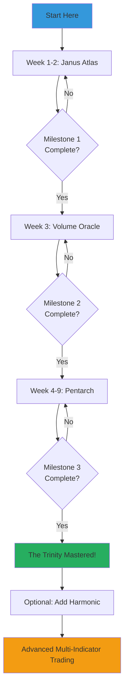
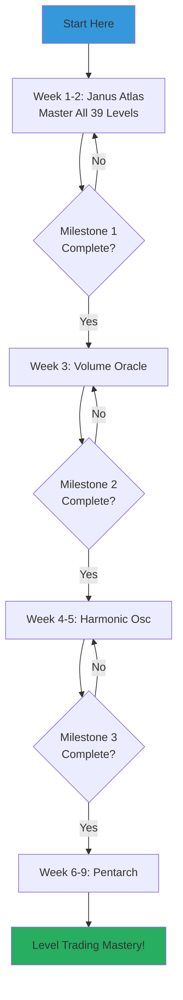
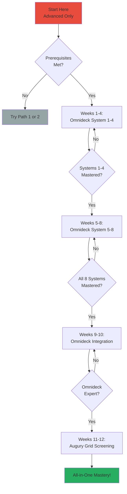

# Signal Pilot Learning Paths

Structured roadmaps to master Signal Pilot indicators based on your trading style and goals.

---

## 🎯 Choose Your Path

Not sure which indicators to learn first? Take the **2-Minute Assessment** below, then follow your recommended path.

---

## 📋 Quick Assessment

**Answer these 5 questions:**

1. **What's your trading timeframe?**
   - A) Scalping / Intraday (5m-1H)
   - B) Day / Swing trading (1H-Daily)
   - C) Position trading (Daily-Weekly)

2. **What's your experience level?**
   - A) Beginner (< 6 months)
   - B) Intermediate (6 months - 2 years)
   - C) Advanced (2+ years)

3. **How much time can you dedicate to learning?**
   - A) 5-10 hours/week
   - B) 10-20 hours/week
   - C) 20+ hours/week

4. **What's your primary goal?**
   - A) Find support/resistance levels
   - B) Identify market cycles and phases
   - C) Master comprehensive all-in-one analysis

5. **Do you prefer:**
   - A) Simple, focused tools (1-2 indicators)
   - B) Multi-indicator confluence approach
   - C) Complex, feature-rich systems

**Results:**

- **Mostly A's:** → **[Path 2: Level Trading Focus](#path-2-level-trading-focus)**
- **Mostly B's:** → **[Path 1: Cycle Trading Focus](#path-1-cycle-trading-focus)**
- **Mostly C's:** → **[Path 3: All-in-One Mastery](#path-3-all-in-one-mastery)**

---

## 🛤️ Path 1: Cycle Trading Focus

**Best for:** Day/swing traders who want to understand market cycles and identify high-probability reversals

**Total Time:** 9-13 weeks | **Difficulty:** 🟡 Moderate

**You'll Learn:** Cycle phase identification, level confluence, volume confirmation, momentum filtering

---

### Path 1 Flowchart

---

### Step 1: Janus Atlas (Weeks 1-2)

**Time Commitment:** 10-15 hours total

**Objective:** Master support/resistance level identification

#### Week 1 Tasks:
- [ ] Read [Janus Atlas documentation](../indicators/janus-atlas-v10.md)
- [ ] Install indicator on TradingView
- [ ] Enable only 5 core levels: Daily H/L, Weekly H/L, Anchored VWAP
- [ ] Observe how price reacts at these levels for 3+ days
- [ ] Identify your first level cluster (3+ levels within 1-2%)

#### Week 2 Tasks:
- [ ] Add 5 more level types (Monthly H/L, POC, VAH, VAL, Previous Day Close)
- [ ] Practice identifying level clusters daily
- [ ] Observe at least 10 level reactions (bounces or breaks)
- [ ] Set up alerts for when price approaches key levels

**Milestone 1 Checklist:**
- ✓ Can identify all 5 core Janus levels
- ✓ Recognize level clusters vs individual levels
- ✓ Observed 10+ price reactions at levels
- ✓ Configured alerts successfully
- ✓ Understand difference between support and resistance

**Quiz:** Can you explain why a Daily High at 50,000 + Weekly High at 50,200 = stronger resistance than either level alone? If yes, proceed to Step 2.

---

### Step 2: Volume Oracle (Week 3)

**Time Commitment:** 8-12 hours total

**Objective:** Add volume confirmation to level analysis

#### Week 3 Tasks:
- [ ] Read [Volume Oracle documentation](../indicators/volume-oracle-v10.md)
- [ ] Install indicator (enable all 3 systems: Flow, Zones, Position Manager)
- [ ] Identify your first volume spike (>1.5x average)
- [ ] Compare volume zones vs Janus Atlas price levels
- [ ] Observe 5+ examples where level reaction had volume spike confirmation
- [ ] Use Position Manager to track a practice position

**Milestone 2 Checklist:**
- ✓ Understand difference between volume spikes and zones
- ✓ Can identify high volume (green) vs low volume (red/yellow)
- ✓ Observed 5+ confluences: level reaction + volume spike
- ✓ Used Position Manager to track P&L
- ✓ Recognize volume-price divergence

**Quiz:** If price bounces from Janus support with low volume (red zone), is this stronger or weaker than a bounce with high volume (green zone)? If you answered "weaker," proceed to Step 3.

---

### Step 3: Pentarch (Weeks 4-9)

**Time Commitment:** 30-40 hours total

**Objective:** Master cycle phase identification and combine with Janus + Volume for maximum confluence

#### Weeks 4-5: Learn the 5 Cycle Events
- [ ] Read [Pentarch documentation](../indicators/pentarch-v10.md)
- [ ] Install indicator on Daily chart first (clearest patterns)
- [ ] Learn to recognize all 5 signals: TD, IGN, WRN, CAP, BDN
- [ ] Observe your first complete cycle (TD→IGN→WRN→CAP→BDN)
- [ ] Identify early-cycle (TD, IGN) vs late-cycle (WRN, CAP, BDN) signals

#### Weeks 6-7: Pattern Sequences
- [ ] Observe at least 20 Pentarch signals total
- [ ] Recognize TD→IGN early-cycle sequence (5 examples)
- [ ] Recognize WRN→CAP late-cycle sequence (5 examples)
- [ ] Identify failed patterns (TD with no IGN follow-through)
- [ ] Practice on both Daily and 4H timeframes

#### Weeks 8-9: The Trinity Integration
- [ ] Combine Pentarch + Janus + Volume Oracle
- [ ] Find 3 examples of all three aligning:
  - Pentarch TD at Janus Daily Low + Volume spike
  - Pentarch IGN at Janus support cluster + Volume spike
  - Pentarch CAP at Janus Weekly High + Volume spike
- [ ] Practice The Trinity workflow:
  1. Wait for Pentarch pattern
  2. Check if pattern appears AT Janus level cluster
  3. Confirm with Volume Oracle spike (>1.5x)

**Milestone 3 Checklist:**
- ✓ Can identify all 5 Pentarch signals on sight
- ✓ Observed 20+ total signals across multiple assets
- ✓ Recognized complete cycle sequences
- ✓ Found 3+ examples of Trinity confluence (all 3 indicators aligned)
- ✓ Understand early-cycle vs late-cycle signals
- ✓ Can explain why TD alone is weaker than TD + Janus support + Volume spike

**Final Quiz:** If Pentarch shows IGN pattern at 48,000, Janus shows Daily Low cluster at 47,900-48,100, and Volume Oracle shows 2.1x volume spike—what makes this a high-probability setup? If you can explain "3-factor confluence in early-cycle phase," you've mastered The Trinity!

---

### Optional: Add Harmonic Oscillator (Weeks 10-11)

**Time Commitment:** 8-12 hours

**Objective:** Add momentum layer for additional confirmation

- [ ] Read [Harmonic Oscillator documentation](../indicators/harmonic-oscillator-v10.md)
- [ ] Learn the 4 signals: BUY, SELL, STRONG, NEUT
- [ ] Filter Pentarch patterns with Harmonic:
  - Pentarch IGN + Harmonic BUY/STRONG = Aligned
  - Pentarch CAP + Harmonic SELL/STRONG = Aligned
- [ ] Observe 5+ examples of aligned signals

---

### Path 1 Summary

**Indicators Mastered:** Janus Atlas, Volume Oracle, Pentarch, (optional) Harmonic Oscillator

**Total Investment:** 48-67 hours over 9-13 weeks

**Outcome:** You can identify high-probability setups using The Trinity (Pentarch + Janus + Volume) with optional momentum confirmation.

**Next Steps:** Practice The Trinity workflow daily, track results, refine your criteria for what constitutes "strong confluence."

---

---

## 🎯 Path 2: Level Trading Focus

**Best for:** Beginners who want to start with simple, visual tools and gradually build complexity

**Total Time:** 9-11 weeks | **Difficulty:** 🟢 Easier

**You'll Learn:** Support/resistance mastery, volume confirmation, momentum at levels, cycle patterns at key levels

---

### Path 2 Flowchart

---

### Step 1: Janus Atlas Deep Dive (Weeks 1-2)

**Time Commitment:** 15-20 hours

**Objective:** Master ALL 39 level types and multi-timeframe analysis

#### Week 1: Core Levels (5 types)
- [ ] Daily High/Low, Weekly High/Low, Anchored VWAP
- [ ] Identify 10+ level reactions

#### Week 2: Advanced Levels (34 types)
- [ ] Monthly/Quarterly/Yearly levels
- [ ] Session levels (Asian, European, North American)
- [ ] VWAP variations (Daily, Weekly, Monthly, Previous)
- [ ] Volume Profile (POC, VAH, VAL)
- [ ] Market Structure (HH, HL, LH, LL, BOS, CHoCH)

**Milestone 1:**
- ✓ Can identify all 39 level types
- ✓ Configured custom level setup for your trading style
- ✓ Understand multi-timeframe level confluence

---

### Step 2: Volume Oracle (Week 3)

(Same as Path 1, Step 2 - see above)

---

### Step 3: Harmonic Oscillator (Weeks 4-5)

**Time Commitment:** 10-15 hours

**Objective:** Add momentum confirmation for level bounces/breaks

- [ ] Learn 7-oscillator voting system
- [ ] Identify momentum at key Janus levels:
  - BUY/STRONG at support = potential bounce
  - SELL/STRONG at resistance = potential rejection
- [ ] Observe 10+ examples of momentum confirming level reactions

**Milestone 3:**
- ✓ Understand voting system consensus
- ✓ Can filter level trades with momentum
- ✓ Recognize when momentum conflicts with levels (sideways/choppy)

---

### Step 4: Pentarch (Weeks 6-9)

**Time Commitment:** 20-30 hours

**Objective:** Identify cycle patterns AT your mastered Janus levels

- [ ] Learn 5 cycle events
- [ ] Find Pentarch patterns appearing at Janus levels:
  - TD at Daily/Weekly Low
  - IGN at support cluster
  - CAP at Weekly/Monthly High
  - WRN at resistance cluster
- [ ] Build complete setup: Level + Volume + Momentum + Cycle pattern

**Final Milestone:**
- ✓ Can identify Pentarch patterns at key levels
- ✓ Built 4-factor confluence model: Janus + Volume + Harmonic + Pentarch

---

### Path 2 Summary

**Indicators Mastered:** Janus Atlas (expert), Volume Oracle, Harmonic Oscillator, Pentarch

**Total Investment:** 45-65 hours over 9-11 weeks

**Outcome:** Expert-level support/resistance trader with volume, momentum, and cycle confirmation layers.

---

---

## 🚀 Path 3: All-in-One Mastery

**Best for:** Advanced traders with 100+ hours to invest who want comprehensive multi-system analysis

**Total Time:** 10-14 weeks | **Difficulty:** 🔴 Very Hard

**Prerequisites:**
- 2+ years trading experience
- Familiar with TD Sequential, VWAP, oscillators, volume flow
- High tolerance for visual complexity
- Can dedicate 20+ hours/week

---

### Path 3 Flowchart

---

### Weeks 1-4: Omnideck Systems 1-4

**Time Commitment:** 40-50 hours

#### System 1: TD Sequential (Week 1)
- [ ] Master Setup counts (1-9)
- [ ] Master Countdown (1-13)
- [ ] Identify exhaustion signals

#### System 2: VWAP Analysis (Week 2)
- [ ] Anchored VWAP from highs/lows
- [ ] VWAP as dynamic support/resistance
- [ ] Multi-timeframe VWAP confluence

#### System 3: Oscillators (Week 3)
- [ ] RSI, Stochastic, CCI interpretation
- [ ] Overbought/oversold zones
- [ ] Divergences

#### System 4: Volume Flow (Week 4)
- [ ] Buying vs selling pressure
- [ ] Volume-price relationships
- [ ] Accumulation/distribution

**Milestone 1:**
- ✓ Can use Systems 1-4 independently
- ✓ Understand how each system complements others

---

### Weeks 5-8: Omnideck Systems 5-8

**Time Commitment:** 40-50 hours

#### System 5: Regime Classification (Week 5)
- [ ] Bullish/bearish/neutral regimes
- [ ] Regime shifts and implications

#### System 6: NanoFlow (Week 6)
- [ ] Momentum oscillator interpretation
- [ ] Zero-line crosses

#### System 7: Zones (Week 7)
- [ ] Support/resistance zones
- [ ] Zone strength analysis

#### System 8: Levels (Week 8)
- [ ] Key price levels across timeframes
- [ ] Level confluence

**Milestone 2:**
- ✓ Can use all 8 Omnideck systems
- ✓ Practiced each system on multiple assets

---

### Weeks 9-10: Omnideck Integration

**Time Commitment:** 20-30 hours

**Objective:** Synthesize all 8 systems for comprehensive analysis

- [ ] Build decision framework using all systems
- [ ] Identify when systems agree (high confluence)
- [ ] Identify when systems conflict (stay out)
- [ ] Create custom alerts for multi-system setups

**Milestone 3:**
- ✓ Can analyze chart using all 8 systems simultaneously
- ✓ Built personal Omnideck interpretation framework
- ✓ Identified 10+ high-confluence setups

---

### Weeks 11-12: Augury Grid

**Time Commitment:** 15-20 hours

**Objective:** Screen multiple assets with Omnideck analysis

- [ ] Configure Augury Grid with 20-50 assets
- [ ] Learn to scan grid for best Omnideck setups
- [ ] Practice morning market scan workflow

**Final Milestone:**
- ✓ Can screen 30+ assets in under 10 minutes
- ✓ Identify top 3 setups daily using Omnideck + Grid

---

### Path 3 Summary

**Indicators Mastered:** Omnideck (all 8 systems), Augury Grid

**Total Investment:** 115-150 hours over 10-14 weeks

**Outcome:** Comprehensive multi-system analysis capability with efficient market scanning.

**Warning:** This path is very demanding. Most traders are better served by Path 1 or Path 2.

---

---

## 📊 Time Commitment Comparison

| Path | Total Hours | Weeks | Difficulty | Indicators | Best For |
|------|-------------|-------|------------|------------|----------|
| Path 1: Cycle Trading | 48-67 hours | 9-13 weeks | 🟡 Moderate | 3-4 | Day/swing traders |
| Path 2: Level Trading | 45-65 hours | 9-11 weeks | 🟢 Easier | 4 | Beginners, level traders |
| Path 3: All-in-One | 115-150 hours | 10-14 weeks | 🔴 Very Hard | 2 (complex) | Advanced traders |

---

## 🎓 General Learning Recommendations

### For All Paths:

1. **Paper Trade First**
   - Practice every setup for 2-4 weeks before risking capital
   - Track results in trading journal
   - Identify which setups work best for your style

2. **Focus on One Timeframe**
   - Master indicators on one timeframe first
   - Most common: Daily (swing) or 1H (day trading)
   - Expand to multiple timeframes only after proficiency

3. **Start with Liquid Markets**
   - BTC, SPY, EUR/USD, major stocks
   - Clear patterns, reliable volume data
   - Avoid low-volume altcoins initially

4. **Complete Milestones Before Advancing**
   - Don't rush to next indicator
   - Master current step fully
   - Checklists are designed to ensure readiness

5. **Join the Community**
   - Share charts and analysis
   - Learn from others' examples
   - Get feedback on your interpretations

---

## 🔄 Switching Paths

Feeling stuck? You can switch paths:

- **Path 1 → Path 2:** Add deeper Janus mastery, then add Harmonic before Pentarch
- **Path 2 → Path 1:** You've already mastered levels, now focus on Pentarch depth
- **Path 1 or 2 → Path 3:** Complete your current path first, then tackle Omnideck

**Not Recommended:** Path 3 → Path 1 or 2. If Om nideck is too complex, pause and master individual concepts first.

---

## 📞 Need Help?

- **Stuck on a milestone?** Review the indicator documentation again
- **Not sure which path?** Start with Path 2 (easiest) or take the assessment
- **Technical issues?** support@signalpilot.io

---

## 🎯 Ready to Start?

**Choose your path:**
1. [Path 1: Cycle Trading Focus](#path-1-cycle-trading-focus)
2. [Path 2: Level Trading Focus](#path-2-level-trading-focus)
3. [Path 3: All-in-One Mastery](#path-3-all-in-one-mastery)

**Other Resources:**
- [Indicator Comparison Guide](../ref-comparison/indicator-comparison.md)
- [Glossary](../ref-glossary/index.md)
- [Quick Start Guide](../start-quickstart/index.md)

---

**Last Updated:** January 2025
