```mermaid
graph TD
    A[What's your experience level?] --> B{New to indicators?}
    A --> C{Some experience?}
    A --> D{Advanced trader?}

    B -->|Yes| E[What's your primary goal?]
    C -->|Yes| F[What's your trading style?]
    D -->|Yes| G[What's your focus?]

    E -->|Find support/resistance| H[Janus Atlas]
    E -->|Understand volume| I[Volume Oracle]
    E -->|Both| J[Janus + Volume]

    F -->|Day trading| K[The Trinity]
    F -->|Swing trading| L[Pentarch + Janus]
    F -->|Scalping| M[Volume Oracle + Harmonic]

    G -->|All-in-one| N[Omnideck]
    G -->|Multi-asset scanning| O[Augury Grid]
    G -->|Advanced patterns| P[Pentarch + Plutus]

    style H fill:#3498db
    style I fill:#e74c3c
    style J fill:#9b59b6
    style K fill:#f39c12
    style L fill:#1abc9c
    style M fill:#e67e22
    style N fill:#2ecc71
    style O fill:#34495e
    style P fill:#c0392b
```

# Which Indicator Should I Start With?

Choose the right Signal Pilot indicator for your experience level, trading style, and goals.

---

## 🎯 Quick Recommendation (30 seconds)

### Choose Your Path:

**👋 I'm Brand New to Technical Indicators**
→ Start with: **[Janus Atlas](../REVISED_DOCS_JANUS_ATLAS.md)** ([Quick Reference](ref-cheatsheets/janus-atlas-levels-guide.md)) + **[Volume Oracle](../REVISED_DOCS_VOLUME_ORACLE.md)** ([Quick Reference](ref-cheatsheets/volume-oracle-quick-reference.md))
- **Why:** Simplest concepts (support/resistance + volume)
- **Learning time:** 8-10 hours combined
- **First signal:** Within minutes of loading

---

**📈 I Want to Understand Market Cycles**
→ Start with: **[Pentarch](../REVISED_DOCS_PENTARCH.md)** ([Quick Reference](ref-cheatsheets/pentarch-quick-reference.md))
- **Why:** Identifies where you are in market cycle (accumulation → distribution)
- **Learning time:** 10-60 hours (pattern recognition required)
- **First signal:** Within 1-7 days

---

**⚡ I Want the Most Popular Combination**
→ Start with: **The Trinity** ([Pentarch](../REVISED_DOCS_PENTARCH.md) + [Janus Atlas](../REVISED_DOCS_JANUS_ATLAS.md) + [Volume Oracle](../REVISED_DOCS_VOLUME_ORACLE.md)) — [See all cheat sheets](ref-cheatsheets/all-indicators-at-a-glance.md)
- **Why:** Most comprehensive setup, covers all bases
- **Learning time:** 45-100 hours total
- **Path:** Learn Janus (2 weeks) → Volume (1 week) → Pentarch (4-6 weeks)

---

**🔬 I Want Everything in One Indicator**
→ Start with: **[Omnideck](../REVISED_DOCS_OMNIDECK.md)** ([Quick Reference](ref-cheatsheets/omnideck-quick-reference.md))
- **Why:** 8 systems in one indicator, all-in-one analysis
- **Learning time:** 100+ hours (advanced)
- **Note:** Not recommended as first indicator—master simpler ones first

---

**📊 I Want to Scan Multiple Assets**
→ Start with: **[Augury Grid](../REVISED_DOCS_AUGURY_GRID.md)** ([Quick Reference](ref-cheatsheets/augury-grid-quick-reference.md))
- **Why:** Monitor 30-40 symbols simultaneously for exhaustion signals
- **Learning time:** 12-50 hours
- **Best used with:** Pentarch or Janus for detailed analysis on selected assets

---

## 🧭 Decision Flowchart

---

## 📝 3-Question Quiz

### Question 1: What's your experience level?

**A) Complete beginner** - Never used technical indicators before
→ Recommended: Janus Atlas or Volume Oracle

**B) Some experience** - Used RSI, MACD, moving averages
→ Recommended: Pentarch or The Trinity

**C) Advanced** - Comfortable with complex multi-indicator systems
→ Recommended: Omnideck or full Signal Pilot suite

---

### Question 2: What's your primary trading style?

**A) Scalping** (seconds to minutes, many trades per day)
→ Recommended: [Volume Oracle](../REVISED_DOCS_VOLUME_ORACLE.md) + [Harmonic Oscillator](../REVISED_DOCS_HARMONIC_OSCILLATOR.md) ([Quick Reference](ref-cheatsheets/harmonic-oscillator-quick-reference.md))
→ Timeframes: 1m-5m

**B) Day Trading** (minutes to hours, close all by EOD)
→ Recommended: The Trinity (Pentarch + Janus + Volume)
→ Timeframes: 5m-1H

**C) Swing Trading** (days to weeks)
→ Recommended: Pentarch + Janus Atlas
→ Timeframes: 4H-Daily

**D) Position Trading** (weeks to months)
→ Recommended: Pentarch + Plutus Flow
→ Timeframes: Daily-Weekly

---

### Question 3: What's your primary goal?

**A) Find precise entry/exit levels**
→ Recommended: **Janus Atlas** (39 price levels)

**B) Identify market cycle phase**
→ Recommended: **Pentarch** (5 cycle events)

**C) Confirm moves with volume**
→ Recommended: **Volume Oracle** (volume spikes, zones, flow)

**D) Get momentum signals**
→ Recommended: **Harmonic Oscillator** (BUY/SELL/STRONG/NEUT)

**E) Spot divergences**
→ Recommended: **[Plutus Flow](../REVISED_DOCS_PLUTUS_FLOW.md)** ([Quick Reference](ref-cheatsheets/plutus-flow-quick-reference.md)) (OBV divergence detection)

**F) Scan multiple assets quickly**
→ Recommended: **Augury Grid** (multi-symbol screener)

**G) All of the above**
→ Recommended: **Omnideck** (8-in-1 indicator)

---

## 🎓 By Experience Level

### 🟢 Beginners (0-6 months trading experience)

**Start Here:**

1. **Janus Atlas** (Easiest)
   - **Concept:** Price levels (support/resistance)
   - **Learning curve:** Gentle
   - **Time to proficiency:** 8-50 hours
   - **Why first:** Most intuitive concept—"price bounces at levels"

2. **Volume Oracle** (Easy)
   - **Concept:** Volume confirmation
   - **Learning curve:** Gentle
   - **Time to proficiency:** 8-40 hours
   - **Why second:** Simple visual (green = high volume, red = low)

**Avoid:**
- ❌ Omnideck (too complex)
- ❌ Pentarch (requires pattern recognition skills)

**Learning Path:** [Beginner Trinity Path](start-learning-path/index.md#path-1-beginner-the-trinity-45-weeks)

---

### 🟡 Intermediate (6-24 months trading experience)

**Add These:**

3. **Pentarch** (Moderate)
   - **Concept:** Market cycle phase detection
   - **Learning curve:** Moderate (pattern recognition needed)
   - **Time to proficiency:** 10-60 hours
   - **Why now:** Ready to understand cycle dynamics

4. **Harmonic Oscillator** (Easy-Moderate)
   - **Concept:** Multi-oscillator consensus voting
   - **Learning curve:** Moderate
   - **Time to proficiency:** 8-40 hours
   - **Why useful:** Adds momentum confirmation layer

**Learning Path:** [Intermediate Multi-Indicator Path](start-learning-path/index.md#path-2-intermediate-multi-indicator-mastery-8-12-weeks)

---

### 🔴 Advanced (24+ months trading experience)

**Master These:**

5. **Plutus Flow** (Moderate-Advanced)
   - **Concept:** OBV divergence detection
   - **Learning curve:** Moderate (requires understanding of divergences)
   - **Time to proficiency:** 10-50 hours

6. **Augury Grid** (Moderate-Advanced)
   - **Concept:** Multi-asset screening
   - **Learning curve:** Moderate (requires understanding patterns first)
   - **Time to proficiency:** 12-50 hours

7. **Omnideck** (Advanced)
   - **Concept:** 8 systems in one indicator
   - **Learning curve:** Steep (100+ hours)
   - **Time to proficiency:** 100-150 hours
   - **Why last:** Requires understanding individual components first

**Learning Path:** [Advanced Power User Path](start-learning-path/index.md#path-3-advanced-power-user-comprehensive-mastery-15-20-weeks)

---

## 💼 By Trading Style

### Scalping (Seconds to Minutes)

**Best Indicators:**
- ✅ Volume Oracle (volume spikes for entry timing)
- ✅ Harmonic Oscillator (quick momentum signals)
- ⚠️ Janus Atlas (use session levels only, not all 39)

**Timeframes:** 1m, 5m
**Combination:** Volume Oracle + Harmonic Oscillator

**Why:** Fast signals, minimal lag, clear entry/exit cues

---

### Day Trading (Minutes to Hours)

**Best Indicators:**
- ✅ The Trinity (Pentarch + Janus + Volume Oracle)
- ✅ Harmonic Oscillator (for additional confirmation)

**Timeframes:** 5m, 15m, 1H
**Combination:** The Trinity (3 indicators)

**Why:** Covers cycle phase, levels, and volume—comprehensive day trading setup

---

### Swing Trading (Days to Weeks)

**Best Indicators:**
- ✅ Pentarch (cycle phase identification)
- ✅ Janus Atlas (weekly/monthly levels)
- ✅ Plutus Flow (divergences for reversals)

**Timeframes:** 4H, Daily
**Combination:** Pentarch + Janus + Plutus

**Why:** Pattern-based, works on longer timeframes, identifies major turning points

---

### Position Trading (Weeks to Months)

**Best Indicators:**
- ✅ Pentarch (macro cycle analysis)
- ✅ Janus Atlas (monthly/quarterly levels)
- ✅ Plutus Flow (long-term divergences)

**Timeframes:** Daily, Weekly
**Combination:** Pentarch + Plutus Flow

**Why:** Long-term trend and divergence focus

---

## 🏆 Most Popular Combinations

### The Trinity ⭐ (Most Popular)
**Pentarch + Janus Atlas + Volume Oracle**

- **Use case:** Comprehensive analysis for day/swing trading
- **Covers:** Cycle phase + price levels + volume confirmation
- **Learning time:** 45-100 hours
- **Difficulty:** Moderate
- **Workflow:** Pentarch signal → Janus level → Volume spike = high-probability setup

**Perfect for:** Day traders and swing traders wanting complete coverage

---

### The Momentum Stack
**Pentarch + Harmonic Oscillator + Janus Atlas**

- **Use case:** Cycle + momentum + levels
- **Covers:** Phase detection + momentum voting + entry levels
- **Learning time:** 30-80 hours
- **Difficulty:** Moderate

**Perfect for:** Traders who want momentum confirmation with cycles

---

### The Divergence Hunter
**Plutus Flow + Pentarch + Janus Atlas**

- **Use case:** Spotting reversals via divergences
- **Covers:** OBV divergence + cycle shift + support/resistance
- **Learning time:** 40-90 hours
- **Difficulty:** Moderate-Advanced

**Perfect for:** Swing/position traders focused on turning points

---

### The Scanner
**Augury Grid + The Trinity**

- **Use case:** Multi-asset screening → detailed analysis
- **Covers:** 30-40 symbol scan → full analysis on selected assets
- **Learning time:** 60-120 hours
- **Difficulty:** Advanced

**Perfect for:** Traders managing watchlists or trading multiple assets

---

## ⏱️ Time Commitment Guide

| Indicator | Minimum to "Get It" | Time to Proficiency | Mastery |
|-----------|---------------------|---------------------|---------|
| **Janus Atlas** | 2-4 hours | 8-50 hours | 100+ hours |
| **Volume Oracle** | 2-4 hours | 8-40 hours | 80+ hours |
| **Harmonic Oscillator** | 2-4 hours | 8-40 hours | 60+ hours |
| **Pentarch** | 4-8 hours | 10-60 hours | 150+ hours |
| **Augury Grid** | 3-6 hours | 12-50 hours | 100+ hours |
| **Plutus Flow** | 4-8 hours | 10-50 hours | 100+ hours |
| **Omnideck** | 10-20 hours | 100+ hours | 200+ hours |

**Note:** "Minimum to Get It" = basic understanding. "Proficiency" = consistent successful application. "Mastery" = advanced pattern recognition and multi-scenario handling.

---

## 🚀 Recommended Onboarding Sequence

### Week 1: Foundation
- **Load:** Janus Atlas
- **Goal:** Understand support/resistance levels
- **Time:** 10-15 hours observation + reading
- **Milestone:** Identify 10 level reactions on your charts

### Week 2: Volume Confirmation
- **Add:** Volume Oracle
- **Goal:** Confirm moves with volume
- **Time:** 8-12 hours
- **Milestone:** Spot 5 volume spikes at key levels

### Weeks 3-6: Cycle Understanding
- **Add:** Pentarch
- **Goal:** Identify cycle phases (TD, IGN, WRN, CAP, BDN)
- **Time:** 15-25 hours
- **Milestone:** Observe complete cycle sequence

### Weeks 7-9: Integration
- **Practice:** The Trinity workflow
- **Goal:** Combine all three for high-probability setups
- **Time:** 10-20 hours
- **Milestone:** Find 3 examples of all three aligning

---

## ❓ Common Questions

### Q: Can I start with multiple indicators at once?
**A:** Possible but not recommended. Better to master one indicator fully before adding another. Exception: Janus + Volume can be learned together (complementary, not overwhelming).

### Q: How long until I see results?
**A:** First signal: Minutes to days (depending on indicator). Consistent proficiency: 8-150 hours depending on indicator complexity and your experience level.

### Q: Should I use all 7 indicators?
**A:** No. Most traders use 2-4 indicators. Using all 7 simultaneously creates visual overload and slow charts. Start with 1-2, expand to 3-4 max.

### Q: What if I choose the "wrong" indicator?
**A:** No wrong choice—all indicators are valuable. If one doesn't click, try another. Many users start with Janus, add Volume, then explore others based on needs.

### Q: Can I skip the beginner indicators and go straight to Omnideck?
**A:** Technically yes, but not recommended. Omnideck contains 8 systems—understanding those individual components first makes Omnideck much easier to master.

---

## 🎯 Your Next Steps

**Made your choice?**

1. **Read the indicator documentation:** Click your chosen indicator above
2. **Install on TradingView:** [Installation Guide](#) *(link to installation section)*
3. **Follow the learning path:** [Learning Paths](start-learning-path/index.md)
4. **Join the community:** [Community](../community/index.md)

**Still unsure?**
- Compare all indicators: [Indicator Comparison](ref-comparison/indicator-comparison.md)
- Check system requirements: [System Requirements](about-system-requirements.md)
- Read the FAQ: [FAQ](about-faq/index.html)

---

**Need Help Deciding?**
Contact support@signalpilot.io with your trading style, goals, and experience level—we'll recommend the best starting point.
